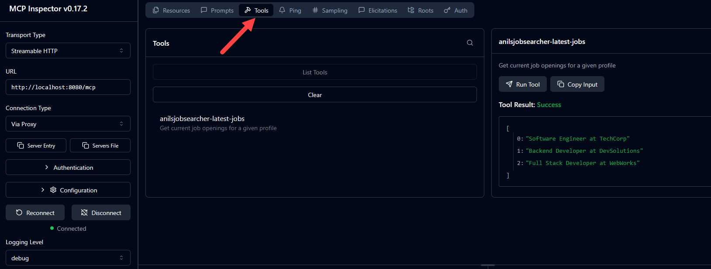

# jobsearchermcpserver

Bu bir Spring AI ile MCP projesi.
Spring boot app baslattiktan sonra asagidaki komut ile mcp server a baglanabiliyoruz.

Docker ile local custom caatalog olusturup mcp server eklemeye calistim. Amacim Calaude app ile onu calistirmak idi ama olmadi. 
Docker Hub a push ettim. Docker Desktop üzeindeki Ask Gordon ile denedim.- 

 # npx @modelcontextprotocol/inspector

Run the following commands to build and run the Docker container:

docker build -t jobsearchermcpserver .

docker run -p 8080:8080 jobsearchermcpserver